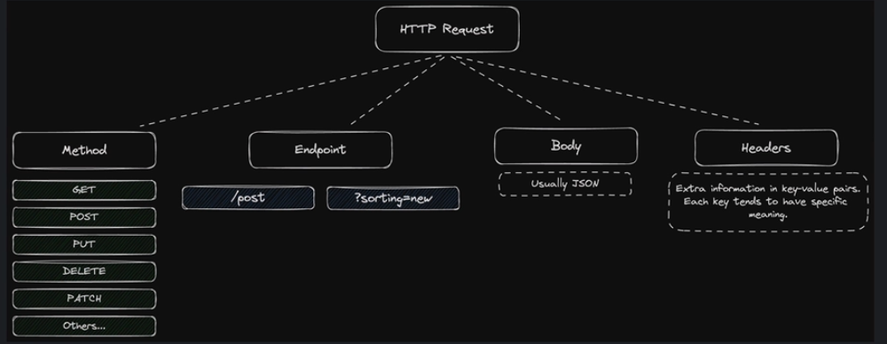

Web APi

GET /post/Hello ; GET - method, '/post/Hello' - Endpoint

HTTP Request = Method + Endpoint + Body + Headers

REST contraints:
1) Should use the concepts of 'client' and 'server'
2) Should use the concepts of 'resource'
3) Should be stateless
4) Should be cacheable
5) Should have a uniform, hypermedia-driven interface
6) If the backend uses multiple servers, this should be invisible to the client

What is a resource? - Post, comments , likes, users, etc
example - when the client makes a request, its  a request about a particular resource
            give me the post with ID 3

What does stateless mean? - The server doesn't keep any information about the clients
For example : the client wants to 
                    - get information about post ID 3
                    - change the post's title
                This should be two requests (one GET and one PATCH)
                In both requests, the client must say what post its talking about

                So - 'change the title of post ID 3' , is the correct request

What does Cacheable mean? - 
    If one client makes a request for information, it should be possible for the backend to save that response
    so when and if another client makes a request for the same information, it doesn't have to be recalculated

What does Hypermedia-driven mean? - 
    If a resource is related to another resource, then there should be an actual link in the response which allows the client to 'find' the related resources

What does Multiple servers mean? - 
    Sometimes backends are made up of multiple servers, for example one server for posts and comments and another for user authentication and registration.
    The client shouldnt be bothered about how the backend is organised

Steps:
1) Initial Vscode setup 
2) linting ,formating and sorting imports with _ruff_
3) 
